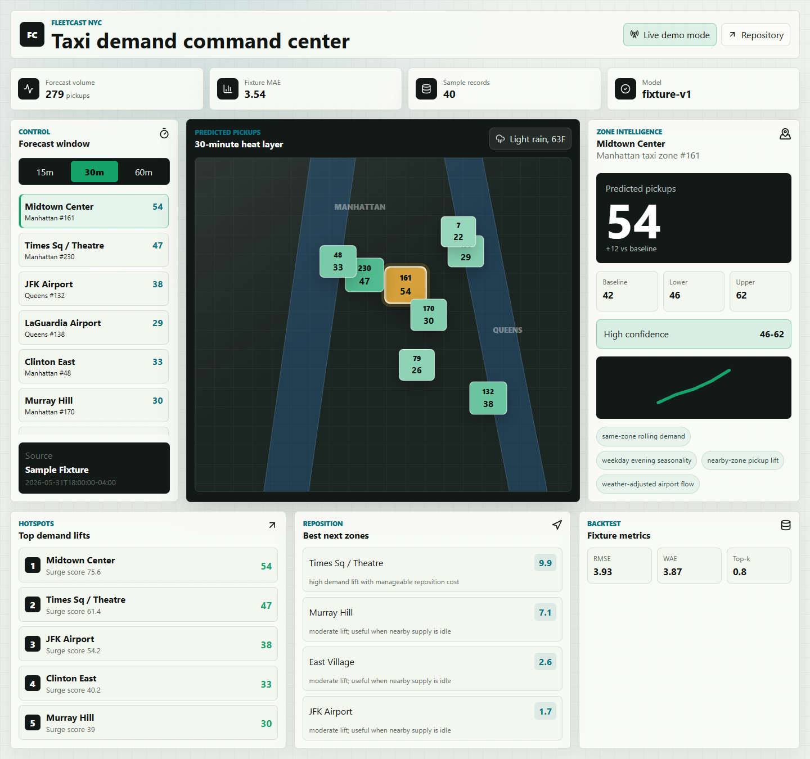

# FleetCast NYC

FleetCast NYC is a public ML product demo for forecasting NYC taxi demand by taxi zone and recommending simple repositioning moves for idle drivers.

The first scaffold ships a working Next.js operations console, API contracts, a Python modeling skeleton, and a generated fixture forecast artifact. The next build step is replacing the committed sample fixture with NYC TLC trip-derived aggregates.



## Current Status

- App shell: built
- Demo forecast APIs: built
- Python ML artifact pipeline: built
- Public data ingestion helpers: built
- Production UI polish: built
- Live deployment: pending one-time Vercel CLI login

## Demo Surface

- `GET /api/health`
- `GET /api/forecast?horizon=30&zoneId=161`
- `GET /api/hotspots?horizon=30&limit=5`
- `GET /api/reposition?originZoneId=161&horizon=30`

## Data Sources

- NYC TLC Trip Record Data
- NYC taxi zone lookup and geometry assets
- National Weather Service API

Raw trip data should stay outside Git. The repository should only include small fixtures, aggregate examples, schemas, and generated demo artifacts.

## Ingestion

```powershell
npm run ingest:zones
npm run ingest:sample
python ml/src/fleetcast/ingest.py yellow-url 2025 1
```

`ingest:zones` downloads the official TLC taxi zone lookup CSV into `data/raw/`, which is ignored by Git. `ingest:sample` converts the committed TLC-style raw trip fixture into 15-minute zone demand buckets under `data/processed/`, also ignored by Git.

## Local Development

```powershell
npm install
npm run train:demo
npm run dev
```

Open:

```text
http://127.0.0.1:3000
```

If PowerShell blocks `npm.ps1`, use `npm.cmd` or run from a fresh terminal after Node installation.

## Verification

```powershell
npm run build
npm run lint
npm run test:ml
npm run verify
```

Demo artifact commands:

```powershell
npm run train:demo
npm run backtest:demo
```

Current fixture metrics:

- MAE: `3.5443`
- RMSE: `3.9257`
- weighted absolute error: `3.8687`
- top-k hotspot precision: `0.8`

## ML Plan

Targets:

- zone-level demand for 15, 30, and 60 minute horizons
- hotspot ranking by predicted demand lift
- reposition score based on expected demand gain and distance penalty

First real model path:

- historical mean baseline
- leakage-safe lag and rolling features
- LightGBM or XGBoost tree model
- time-based backtest

## Deployment Plan

- Frontend/API: Vercel
- Target URL: `fleetcast.meetgandhi.com`
- Database: Neon Postgres
- Refresh/retraining: GitHub Actions
- Fallback inference: FastAPI on Render, Fly.io, or Railway if the model becomes too heavy for Vercel Functions

See `docs/deployment.md` for the exact Vercel project, production deploy, and custom-domain commands.

## Resume Outcomes

- Built a production-style ML forecasting platform that predicted NYC taxi demand by zone using spatiotemporal features, weather enrichment, and time-based backtesting.
- Shipped a full-stack interactive demo with Next.js, Postgres, and serverless APIs to visualize hotspot forecasts and driver reposition recommendations on a live NYC map.
- Engineered reproducible data pipelines, evaluation workflows, and cross-layer tests for a public-safe ML system deployed to the cloud.
